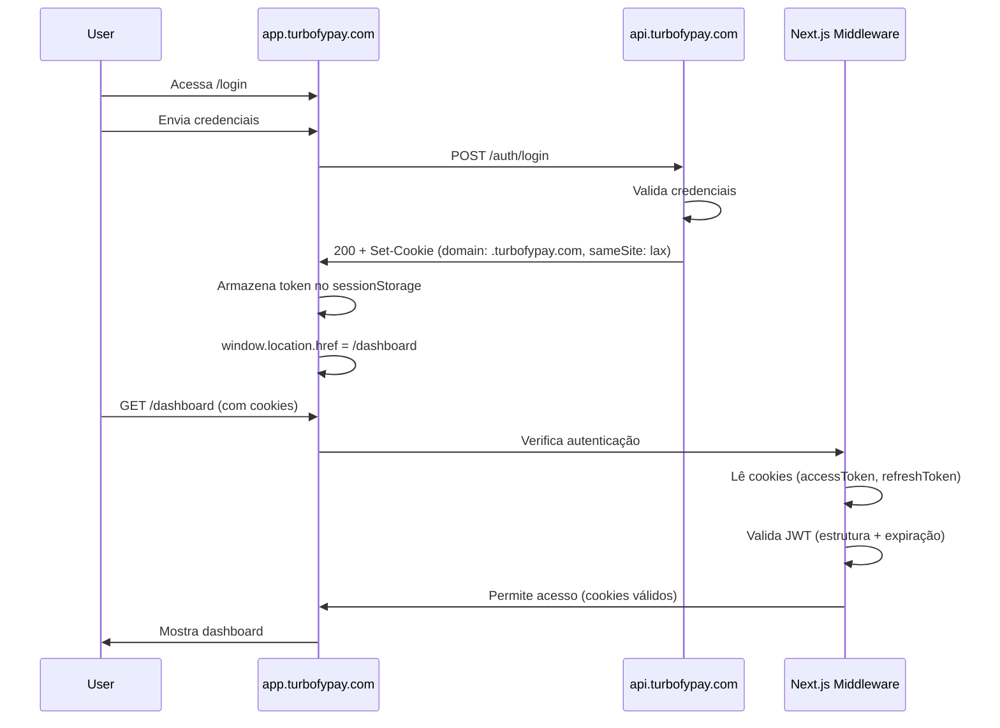

# 🍪 Configuração de Cookies - Turbofy Backend

## Problema Identificado

O login estava falhando em produção devido a cookies com `sameSite: 'strict'` não sendo enviados entre subdomínios diferentes (`api.turbofypay.com` → `app.turbofypay.com`).

## Solução Implementada

### Configuração de Cookies (Produção)

```typescript
const isProduction = process.env.NODE_ENV === 'production';
const cookieDomain = isProduction ? '.turbofypay.com' : undefined;

res.cookie('accessToken', token, {
  httpOnly: true,          // ✅ Proteção XSS (cookie não acessível via JavaScript)
  secure: isProduction,    // ✅ HTTPS only em produção
  sameSite: 'lax',        // ✅ Permite cookies em navegações top-level (após login)
  maxAge: 15 * 60 * 1000, // ✅ 15 minutos
  path: '/',              // ✅ Disponível em todo o site
  ...(cookieDomain && { domain: cookieDomain }), // ✅ Funciona em todos os subdomínios
});
```

## Por que `sameSite: 'lax'` ao invés de `'strict'`?

### `sameSite: 'strict'` (Anterior - Problemático)
- ❌ Cookies **não** enviados em navegações cross-site (mesmo entre subdomínios)
- ❌ Cookies **não** enviados após redirecionamento de login
- ❌ Causava loop de redirecionamento `/dashboard` → `/login` → `/dashboard`

### `sameSite: 'lax'` (Atual - Correto)
- ✅ Cookies enviados em navegações top-level (GET requests)
- ✅ Cookies enviados após redirecionamento de login
- ✅ Cookies funcionam entre `api.turbofypay.com` e `app.turbofypay.com`
- ✅ Ainda protege contra CSRF (cookies não enviados em requisições cross-site POST/PUT/DELETE)

### `sameSite: 'none'` (Não recomendado)
- ❌ Cookies enviados em **todas** as requisições cross-site
- ❌ Maior risco de CSRF
- ❌ Requer `secure: true` (HTTPS obrigatório)

## Domain Configuration

### Desenvolvimento (`localhost`)
```typescript
domain: undefined // Padrão: cookie disponível apenas no domínio exato
```

### Produção (`.turbofypay.com`)
```typescript
domain: '.turbofypay.com' // Cookie disponível em todos os subdomínios:
                           // - api.turbofypay.com
                           // - app.turbofypay.com
                           // - admin.turbofypay.com
```

**Importante**: O ponto (`.`) antes do domínio é crucial - permite que o cookie seja compartilhado entre subdomínios.

## Endpoints Atualizados

Todos os endpoints que definem cookies foram atualizados:

1. **POST /auth/login** - Login do usuário
2. **POST /auth/register** - Registro de novo usuário
3. **POST /auth/refresh** - Renovação de tokens
4. **POST /auth/mfa/verify** - Verificação de MFA
5. **POST /auth/logout** - Logout (clearCookie)

## Fluxo de Login (Corrigido)



## Segurança Mantida

Mesmo com `sameSite: 'lax'`, a segurança é mantida:

### Proteções Ativas
- ✅ **HttpOnly**: Cookies não acessíveis via JavaScript (proteção XSS)
- ✅ **Secure**: HTTPS only em produção (proteção MitM)
- ✅ **SameSite Lax**: Proteção parcial contra CSRF (não envia em POST/PUT/DELETE cross-site)
- ✅ **CSRF Tokens**: Token CSRF adicional em requisições mutáveis
- ✅ **JWT Validation**: Backend valida assinatura JWT em todas as requisições
- ✅ **Middleware Validation**: Next.js middleware valida estrutura e expiração do JWT

### Proteções Adicionais
- ✅ **Rate Limiting**: Middleware com 200 req/min (normal), 500 req/min (IPs conhecidos)
- ✅ **Login Attempts Locking**: Backend bloqueia após múltiplas tentativas falhadas
- ✅ **Token Expiration**: Access token expira em 15 minutos
- ✅ **Refresh Token Rotation**: Refresh token rotacionado a cada renovação

## Testing Checklist

- [ ] Login funciona em `app.turbofypay.com`
- [ ] Cookies são definidos com `domain: .turbofypay.com`
- [ ] Cookies são enviados em requisições para `api.turbofypay.com`
- [ ] Middleware do Next.js valida cookies corretamente
- [ ] Não há loop de redirecionamento `/dashboard` → `/login`
- [ ] Logout limpa cookies corretamente
- [ ] Refresh token funciona após expiração do access token

## Troubleshooting

### Cookies não estão sendo enviados
1. Verificar se `domain: '.turbofypay.com'` está configurado em produção
2. Verificar se `sameSite: 'lax'` está configurado (não `'strict'`)
3. Verificar se `secure: true` em produção (HTTPS obrigatório)
4. Verificar no DevTools → Application → Cookies se os cookies estão definidos

### Loop de redirecionamento
1. Verificar se o middleware do Next.js está lendo os cookies corretamente
2. Verificar se `hasValidAuth()` está validando JWT corretamente
3. Verificar se o backend está definindo cookies no response do login

### CORS errors
1. Verificar se CORS está configurado para aceitar `app.turbofypay.com`
2. Verificar se `credentials: true` está configurado no axios/fetch
3. Verificar se backend retorna `Access-Control-Allow-Credentials: true`

## References

- [MDN: SameSite Cookies](https://developer.mozilla.org/en-US/docs/Web/HTTP/Headers/Set-Cookie/SameSite)
- [OWASP: Cross-Site Request Forgery Prevention](https://cheatsheetseries.owasp.org/cheatsheets/Cross-Site_Request_Forgery_Prevention_Cheat_Sheet.html)
- [Chrome SameSite Cookie Changes](https://www.chromium.org/updates/same-site)

