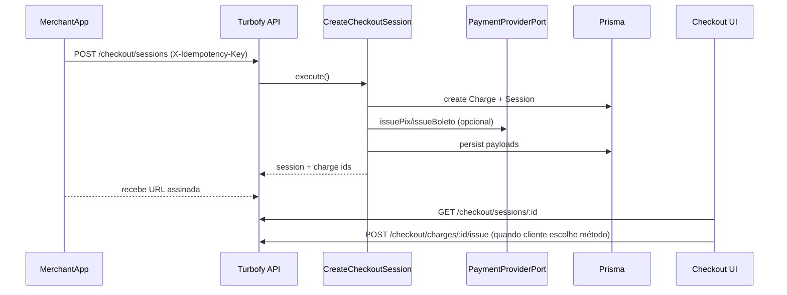

# Turbofy – Fluxo de Checkout White-Label

Documenta como o backend expõe sessões de checkout, gera Pix/Boleto e alimenta a UI (`frontend/src/components/checkout/PaymentSelector.tsx`).

---

## 1. Visão Geral
- Merchants criam sessões através de `POST /checkout/sessions`.
- O backend instancia uma `Charge`, aplica temas e retorna uma URL pública (`{FRONTEND_URL}/checkout/:sessionId`).
- O cliente final acessa a página, que consome `GET /checkout/sessions/:id`.
- Caso precise gerar novamente Pix/Boleto, a UI chama `POST /checkout/charges/:id/issue` com idempotência.



---

## 2. Casos de Uso
### CreateCheckoutSession (`backend/src/application/useCases/CreateCheckoutSession.ts`)
- Cria `Charge` idempotente.
- Sincroniza configurações visuais através de `PrismaCheckoutConfigRepository`.
- Dispara eventos de criação de cobrança (`MessagingPort`).

### IssuePaymentForCharge (`backend/src/application/useCases/IssuePaymentForCharge.ts`)
- Recebe `chargeId` e `method` (PIX/BOLETO).
- Resolve provider via `PaymentProviderFactory.createForMerchant`.
- Atualiza `Charge` com QR Code / boleto e retorna payload.

---

## 3. Endpoints HTTP
| Método | Caminho | Descrição |
| --- | --- | --- |
| `POST` | `/checkout/sessions` | Cria sessão white-label. Requer header `X-Idempotency-Key`. |
| `GET` | `/checkout/sessions/:id` | Retorna sessão + charge associada para renderização. |
| `POST` | `/checkout/charges/:id/issue` | Reemite Pix/Boleto (idempotente via header). |
| `GET` | `/checkout/config?merchantId=` | Recupera configurações de tema (dashboard). |
| `PUT` | `/checkout/config` | Atualiza snapshot de tema/logos (dashboard). |

### Schemas
- Requests/Responses Zod em `backend/src/infrastructure/http/schemas/checkout.ts`.
- Campos principais consumidos pelo frontend:
  - `pix: { qrCode: string; copyPaste: string; expiresAt: string }`
  - `boleto: { boletoUrl: string; expiresAt: string }`
  - `theme: { logoUrl?: string; themeTokens?: Record<string, unknown>; animations?: boolean }`

---

## 4. Frontend Contract
`PaymentSelector` espera o seguinte shape (`SessionResponse`):
```ts
interface SessionResponse {
  id: string;
  chargeId: string;
  merchantId: string;
  status: "CREATED" | "OPENED" | "COMPLETED" | "EXPIRED";
  amountCents: number;
  currency: string;
  description: string | null;
  pix?: { qrCode: string; copyPaste: string; expiresAt: string };
  boleto?: { boletoUrl: string; expiresAt: string };
  theme?: { logoUrl?: string | null; themeTokens?: Record<string, unknown> | null; animations?: boolean } | null;
  expiresAt: string | null;
  createdAt: string;
}
```
- Ao gerar Pix/Boleto, a UI envia `POST /checkout/charges/:id/issue` com body `{ "method": "PIX" | "BOLETO" }` e header `X-Idempotency-Key`.
- O backend garante que `pix.copyPaste` está disponível e que `expiresAt` acompanha a janela do provedor.

---

## 5. Temas e Configurações
- Repository: `PrismaCheckoutConfigRepository`.
- Campos:
  - `logoUrl`: URL pública de logo.
  - `themeTokens`: JSON com overrides (cores, radius, etc.).
  - `animations`: boolean controlando framer-motion na UI.
- Snapshot é gravado em `CheckoutSession.themeSnapshot` no momento da criação para evitar inconsistências.

---

## 6. Observabilidade e Segurança
- Todos os endpoints exigem `X-Idempotency-Key`.
- Logs (Pino) incluem `traceId` = chave de idempotência.
- Eventos `checkout.session.created` podem ser adicionados reutilizando `MessagingPort` se necessário.
- Dados sensíveis (Pix/Boleto) nunca são armazenados no frontend; sempre buscados via API assinada.

---

## 7. Próximos Passos
- Expandir para métodos adicionais (cartão, Pix parcelado) implementando novos métodos em `PaymentProviderPort`.
- Adicionar eventos específicos do checkout (session.opened/completed).
- Criar testes E2E cobrindo o fluxo completo (frontend + backend) usando Playwright.

Mantenha este documento atualizado sempre que contratos ou endpoints mudarem.

